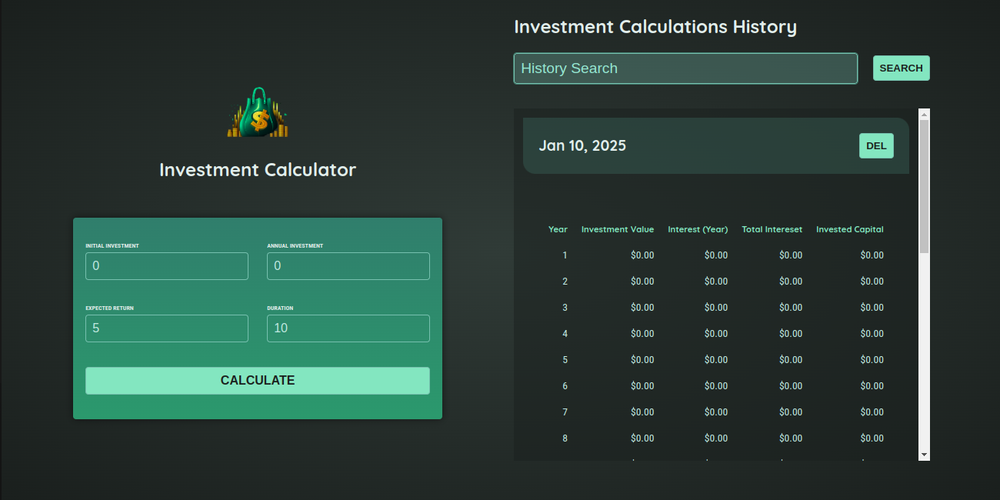
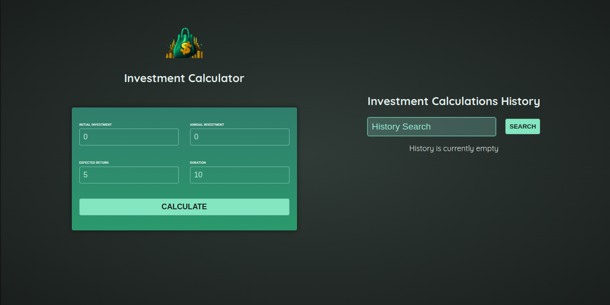

# StartingProject
This project was generated using [Angular CLI](https://github.com/angular/angular-cli) version 19.0.6. It is a simple app for calculating investments.
## Project Showcase



## Cloning the Project

To clone the project, run the following command in your terminal:

```bash
git clone https://github.com/jamesadewara/Angular-Investment-Calculator.git

cd Angular-Investment-Calculator
```

## Running the Project

To install the necessary dependencies and start a local development server, run:

```bash
npm install
ng serve
```

Once the server is running, open your browser and navigate to `http://localhost:4200/`. The application will automatically reload whenever you modify any of the source files.

## Building and Running with http-server

To build the project and serve it using `http-server`, follow these steps:

1. Build the project:

    ```bash
    ng build
    ```

    This will compile your project and store the build artifacts in the `dist/` directory.

2. Install `http-server` globally if you haven't already:

    ```bash
    npm install -g http-server
    ```

3. Navigate to the `dist/` directory and start the server:

    ```bash
    cd dist/Angular-Investment-Calculator
    http-server
    ```

    This will start a local server and you can view your application by navigating to the provided URL, typically `http://localhost:8080/`.
    # Angular Investment Calculator

    This project was generated using [Angular CLI](https://github.com/angular/angular-cli) version 19.0.6.